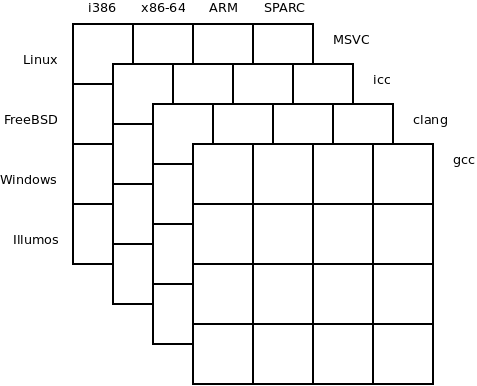

# Cartesian - generator for complex configurations

There's a specific subset of problems in IT industry that have big and somewhat regular domains, but not fully so.

Consider the task of configuring a test suite. You have a fleet of different boxes, with different processors, different operating systems, different compilers, you want to run different tests and do so with different compile-time and run-time options.

In theory, the test suite would be a perfectly regular N-dimensional matrix featuring all the dimensions mentioned above. But that's where the complexity kicks in: Oh! MSVC only works on Windows! Test X requires 8G of memory and the box Y only has 4G available. Shared libraries have .so extension on Linux, .dll extension on Windows and .dylib extension on OSX. I need to switch on valgrind for test X an box Y temporarily to debug a problem. Support for SPARC in our preferred version of LLVM doesn't quite work yet. We need to use older version of LLVM on SPARC plarforms. And so on and so on.

Trying to address this complexity by hand results in a big mess. Trying to address it via inheritance hieratchy doesn't work well either: Different dimensions don't aggregate in classic inheritance hierarchies, rather, they are composed in each-with-each combinatorial manner.



Cartesian is a simple Node module that generates such multidimensional configurations. It does so by allowing to define JavaScript objects with "alternative" properties. An alternative property can have multiple values. Such objects can then be expanded to an array of plain objects, a cartesian product of all the alternative properties:

```javascript
var c = require('./cartesian.js')

var obj = {
    a: 0,
    b: c.alt(1, 2),
    c: c.alt('A', 'B')
}

console.log(c.expand(obj))
```

The output looks like this:

```json
[ { a: 0, b: 1, c: 'A' },
  { a: 0, b: 1, c: 'B' },
  { a: 0, b: 2, c: 'A' },
  { a: 0, b: 2, c: 'B' } ]
```
